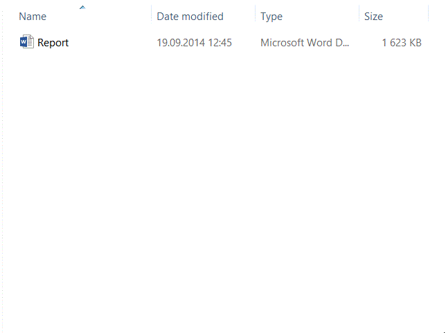

# Date Stamp
Windows Explorer extention to make dated file copies

## Demo


## Build Requirements
Microsoft Visual Studio 2013 for Windows Desktop

## Installation
Copy *Date Stamp.exe* and *Date Stamp.exe.config* to a directory of your choice, then run:
```
Date Stamp.exe /install
```

## Uninstallation
Run:
```
Date Stamp.exe /uninstall
```
then delete *Date Stamp.exe* and *Date Stamp.exe.config*

## Configuration
Date Stamp settings are in the following registry path: *HKEY_CURRENT_USER\Software\Date Stamp*

- DateStampFormat - Date stamp format string (see https://msdn.microsoft.com/en-us/library/8kb3ddd4.aspx). Default is "_ddMMyy".
- FileNameRegex - Regular expression specifying the location to place the date stamp. Default is "(?=\\.[^.\\\\]+$)" (matches a position preceding a filename extension).
